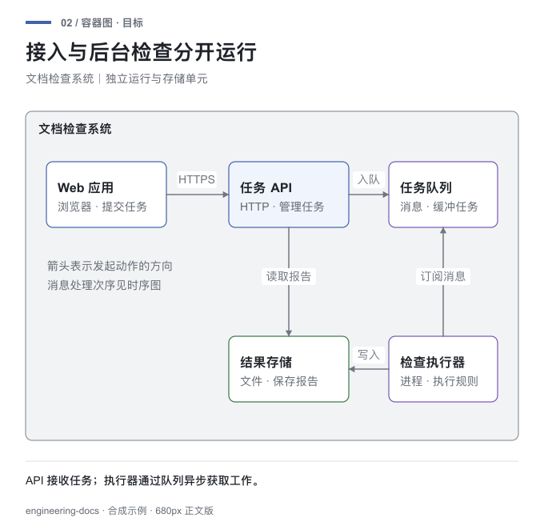
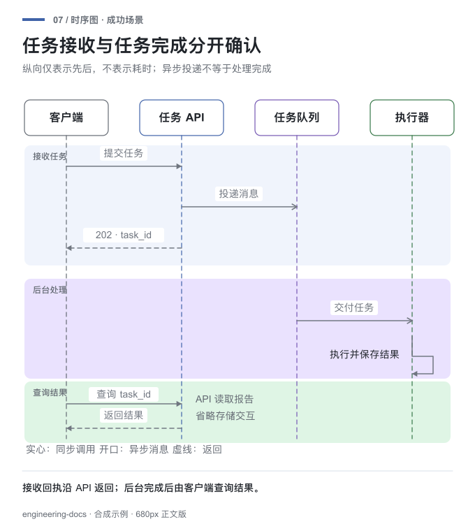
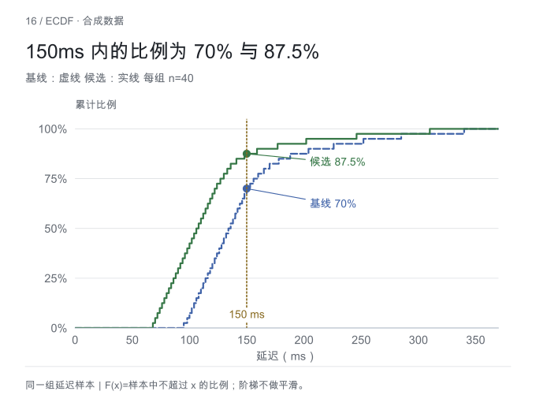
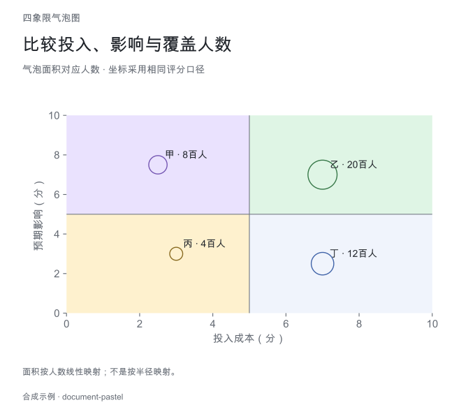

# Engineering Documentation

> One entry point for context gathering, technical decisions, collaborative drafting, diagrams, and reader validation.

[简体中文](./README.md)

## What it can do

| Task | Capability |
| --- | --- |
| Draft from evidence | Read code, interfaces, configuration, logs, and prior decisions to produce a design, RFC, or ADR |
| Update an existing document | Read the full body, diagrams, and appendices before changing conclusions affected by new facts |
| Review a proposal | Check evidence, trade-offs, interfaces, data, failure paths, risk, validation, and rollback |
| Co-author a decision | Work section by section when real choices remain; draft directly when context is sufficient |
| Generate technical visuals | Select architecture, process, sequence, state, data, schedule, or statistical views and retain editable sources |
| Manage formal decisions | In strict mode, track evidence, risk, lifecycle state, and implementability |
| Adapt team templates | Build the engineering decision first, then map it into an existing template |

The skill covers the path from mixed source material to a document that readers can implement and verify.

## Why it exists

AI can produce a well-structured technical document while still identifying the wrong system path, missing a critical constraint, or presenting an assumption as a fact.

A subtler failure is a document that looks complete but moves no decision forward: the problem is mixed with the proposed solution, alternatives are artificial, diagrams disagree with prose, and rollout says only “test thoroughly.”

This skill keeps three objects aligned:

- **Engineering judgment:** facts, inferences, assumptions, decisions, and unresolved questions stay distinct.
- **Reader-facing document:** the structure follows the decision the reader must make, not the internal checklist.
- **Verifiable delivery:** diagrams, interfaces, risks, acceptance, rollout, and rollback must describe the same system.

This skill builds the evidence and decision first, then writes the document. It supports:

- Technical designs and system designs.
- RFCs and architecture decisions.
- Refactoring, migration, and performance proposals.
- Cross-system API, data, and workflow changes.
- Direct drafting from available context or iterative co-authoring with the user.
- Revising engineering decisions when new evidence appears, and reviewing existing proposals.
- Adapting a common decision model to team templates.

It does not own copy-editing, tutorials, operating guides, exhaustive API references, technical explainers, opinion pieces, or speculative essays.

Context gathering, iterative refinement, and independent reader testing are part of this skill. It drafts directly when context is sufficient and switches to collaboration only when key uncertainty or user intent requires it.

The internal decision model is separate from the reader-facing document. Evidence ledgers and G0-G12 gates stay internal by default. The final structure follows the reader's actual questions; goals, boundaries, and option comparisons appear only when they help the decision.

Diagrams are selected by question rather than quota. When boundaries, structure, runtime order, state, data relationships, or schedules are hard to understand in prose, the skill chooses an appropriate view and requires editable source, a real render, and consistency with the document.

## Visual Coverage

[Browse 21 reusable examples and editable sources](assets/visual-examples/README.md). Twelve cover technical views: context, container, component, deployment, flowchart, swimlane, sequence, state, data flow, ER, Gantt, and milestones. Nine cover quantitative views: trend, dumbbell comparison, histogram, ECDF, box plot, scatter, heatmap, stacked composition, and waterfall.

[Browse 26 additional templates](assets/diagram-templates/README.md): layered system architecture, grouped grids, organization and hierarchy trees, mind maps, horizontal and vertical timelines, stage milestones, cycles and flywheels, pyramids, brand houses, matrices, quadrants and bubbles, release trains, development workflows, both swimlane orientations, pie/donut/funnel/radar charts, business canvases, and overlapping or nested sets. These use 20 bounded layout interfaces. The complete collection has 47 synthetic examples with editable SVG and 680px PNG previews.

| Architecture boundary | Runtime sequence |
| --- | --- |
|  |  |
| **Data distribution** | **Multidimensional comparison** |
|  |  |

All renderers share a restrained pastel theme: light grouping areas, white inner entities, dark text, and thin gray relationships. Quantitative marks retain contrast. Diagram shape still follows the reading problem rather than forcing every view into cards.

All examples are synthetic. Type-specific recipes cover layout and semantics; visual guidance covers hierarchy, focus, color, labels, and readability. Quantitative charts preserve data, units, scales, and reproducible calculations. BPMN/DMN guidance does not provide an execution engine. Specialized views such as flame graphs require real measurements and suitable tools. Curated examples do not certify arbitrary inputs or platform imports.

Visual revisions preserve a baseline and improve grouping, label placement, and reading order. The optional [comparison method](references/visual-evaluation.md) uses anonymous, equal-size pairs and separates factual correctness, reading-task answers, and visual preference. Ties and regressions remain in the results.

## How to use it

> Use engineering-docs to write a migration proposal from this code and runtime evidence. Explain the decision, affected systems, validation, and rollback.

> Update the existing design for this API change. Read the full document and diagrams first, preserving decisions that still hold.

> Review this proposal. Focus on evidence, compatibility, failure paths, and rollback rather than copy-editing.

Provide source material and the decision the reader needs to make. Material may include a codebase, APIs, logs, runtime output, an existing document, requirements, or discussion notes.

```text
read source material and current evidence
→ identify the reader's decision
→ establish problem, goals, constraints, and options
→ write the decision, accepted costs, and implementation design
→ add only the visuals that answer real questions
→ complete risks, acceptance, rollout, and rollback
→ test whether an independent reader can recover the decision
```

Ordinary tasks deliver the document and necessary diagram sources and previews. Strict mode adds structured records. Python 3.9+ runs the standard-library validators; reproducing statistical chart examples additionally uses Matplotlib and NumPy.

## Decision Flow

```text
context and reader action
→ evidence and current state
→ problem
→ goals and boundaries
→ constraints
→ candidate options
→ decision and accepted costs
→ implementation design
→ impact and risks
→ validation, rollout, and rollback
→ open questions
```

The skill keeps facts, inferences, assumptions, decisions, and open questions distinct. Missing critical evidence blocks an implementable result. A high-risk proposal without validation, detection, or mitigation remains a draft.

Full gates and structured records belong to strict mode. Ordinary technical documents do not need JSON setup or G0-G12 validation by default.

## Evaluation evidence

### Visual coverage

- The package includes **21 core technical and data visualizations** plus **26 reusable structural templates**, for 47 SVG/PNG examples.
- The 21 core visuals were compared anonymously. Two independent review chains reported **7 wins, 14 ties, 0 losses** and **8 wins, 11 ties, 2 losses** for the final versions.
- Mean five-dimension ratings moved from **4.04 to 4.22** and from **4.19 to 4.37**. The clearest gains were process grouping, sequence boundaries, schedule dependencies, direct differences, and threshold annotations.
- One reviewer still preferred the older deployment and swimlane backgrounds, so the result does not support a universal “white background is better” rule.

### Readability and engineering checks

- An older order-flow diagram was 1525px wide and had to shrink to 44.6% inside a 680px document column. The revised responsibility-based layout is 680×202 and needs no downscaling.
- The current repository runs **31 tests** across document structure, lifecycle rules, templates, and diagrams.
- Visual tests cover valid SVG/XML, accessible descriptions, long-text overflow, timeline proportions, tree cycles, funnel quantities, radar scales, and changing inputs.

These results support the current examples and rules. They do not guarantee that arbitrary systems, models, or renderers will produce correct documents. Project facts still require direct evidence, and every diagram must be inspected in its final medium.

## Structure

```text
engineering-docs/
├── SKILL.md
├── README.md
├── README.en.md
├── references/
│   ├── decision-model.md
│   ├── collaboration-workflow.md
│   ├── diagram-guidance.md
│   ├── diagram-recipes.md
│   ├── visual-design.md
│   ├── visual-evaluation.md
│   ├── data-charts.md
│   ├── diagram-sources.md
│   ├── process-modeling.md
│   ├── portable-delivery.md
│   ├── handoff.md
│   ├── quality-gates.md
│   └── template-adaptation.md
├── assets/visual-examples/
│   ├── README.md
│   ├── render_diagrams.py
│   ├── render_charts.py
│   ├── plan.json
│   ├── chart-data.json
│   ├── theme.json
│   └── gallery/             # Editable SVG and body-size PNG
├── assets/diagram-templates/
│   ├── README.md            # Selection, input schema, and limits
│   ├── examples.json
│   └── gallery/
├── templates/
│   ├── decision-record.json
│   └── engineering-doc.md
├── scripts/
│   ├── engineering_docs.py
│   ├── artifact_io.py
│   ├── render_templates.py
│   └── scoring-rules.json
└── tests/
    ├── test_engineering_docs.py
    └── test_render_templates.py
```

## Strict Mode

Initialize a structured workspace only when lifecycle state, machine validation, or an audit trail is required.

### Initialize a Workspace

```bash
python3 scripts/engineering_docs.py init \
  --title "Session Storage Migration" \
  --author "Author" \
  --type technical-design \
  --output /tmp/session-storage-design
```

The command creates:

- `document.md` for human review.
- `decision-record.json` for evidence, decisions, risks, gates, and lifecycle state.

### Validate

Validate the current state:

```bash
python3 scripts/engineering_docs.py validate \
  --record /tmp/session-storage-design/decision-record.json
```

Check readiness for implementation:

```bash
python3 scripts/engineering_docs.py validate \
  --record /tmp/session-storage-design/decision-record.json \
  --target implementable
```

The script checks machine-verifiable structure, gate status, evidence metadata, risk controls, state rules, reader testing, and unfinished template markers. It does not verify that technical claims are true or approve the decision.

### Transition State

```bash
python3 scripts/engineering_docs.py transition \
  --record /tmp/session-storage-design/decision-record.json \
  --to in_review \
  --actor "Tech Lead" \
  --reason "Author checks completed"
```

Every transition is validated before the record is written, and every accepted transition is appended to `history`.

## Tests

```bash
python3 -m unittest discover -s tests -v
```

## Install

Copy the complete skill directory into your host's Skills directory, or have a file-capable agent read `SKILL.md` and its routed references. Discovery and installation paths vary by host. For TRAE:

```bash
git clone https://github.com/Job-Yang/jobyang-ai-skills.git
cp -R jobyang-ai-skills/skills/engineering-docs ~/.trae/skills/engineering-docs
```
